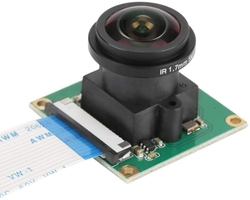

# Absolute Heading Estimation Using Sun Sensor



## Table of contents

- [Quick start](#quick-start)
- [Notes](#notes)
- [Creators](#creators)
- [Copyright and license](#copyright-and-license)

## Quick Start

Install the dependencies:

```
pip install -r requirements.txt
```

Camera calibration:

Print the pattern ```calibration_target/chessboard.png``` on an A4 paper sheet.

Acquire frames of the chessboard using the ```grab_calibration_frames.py``` utility.

Finally, run ```calibrate_camera.py```, if everything goes well you should have a ```calibration.npz``` file inside the ```calibration_data``` folder.

Set your correct location (lat, lon) inside the ```configs/config.yaml``` file.

You can now run the sun sensor script:

```
python sun_sensor.py
```

## Creators

**Federico Zappone**

- <https://github.com/federicozappone>

## Copyright and license

Code released under the [MIT License](https://github.com/federicozappone/sun_sensor_heading_estimation/LICENSE.md).
